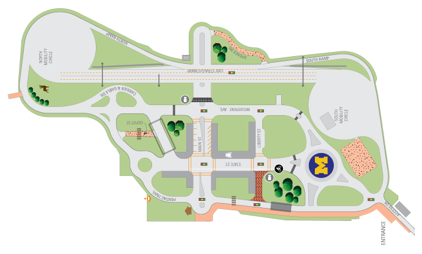
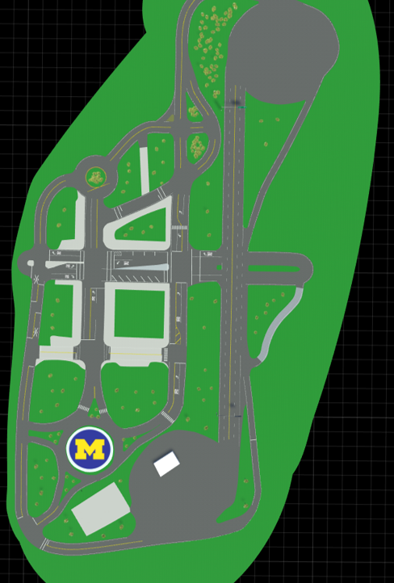
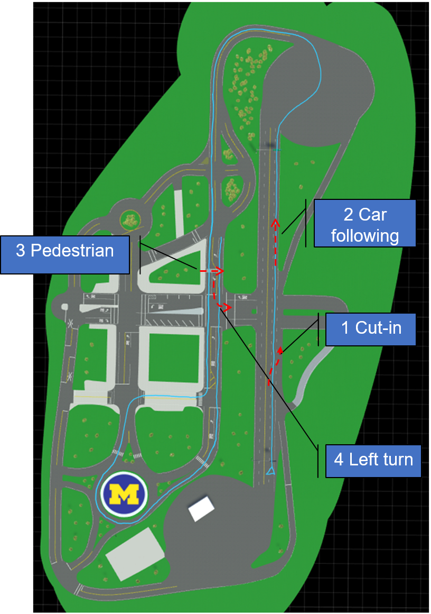
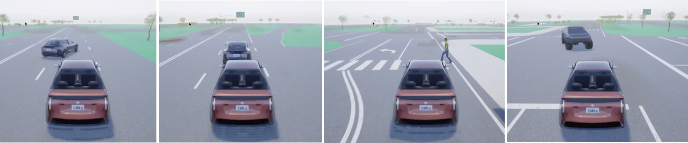
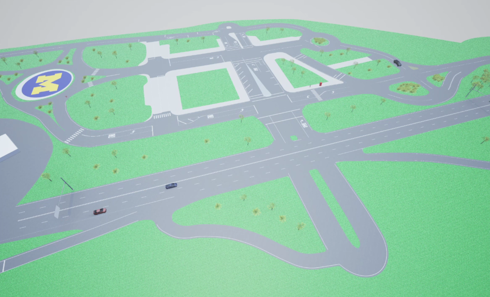

<head>
    <script src="https://cdn.mathjax.org/mathjax/latest/MathJax.js?config=TeX-AMS-MML_HTMLorMML" type="text/javascript"></script>
    <script type="text/x-mathjax-config">
        MathJax.Hub.Config({
            tex2jax: {
            skipTags: ['script', 'noscript', 'style', 'textarea', 'pre'],
            inlineMath: [['$','$']]
            }
        });
    </script>
</head>

# Mcity Carla Challenge

## Where does the challenge take place?
The challenge will be held inside the [Carla](https://carla.org/) virtual town of [Mcity](https://mcity.umich.edu/). Mcity is an 18-acre proving ground purposedly built for the testing of connected and automated vehicles, managed by the University of Michigan in Ann Arbor, Michigan. We built the Carla Mcity based on the true dimensions/layout of the real Mcity test facility, and it serves as just another virtual town for the Carla simulator. The supported Carla version is [0.9.9.4](https://github.com/carla-simulator/carla/tree/0.9.9.4). To learn more about the Carla simulator, please check out the [official documentations](https://carla.readthedocs.io/en/latest/).





## What are the challenges?


The participant will be asked to take control of the vehicle under test (VUT) ('role_name' = "hero", spawned by the organizer) to follow a nominal route, shown by the blue trace in the figure. There will be 4 challenging scenarios along the way, where the environmental vehicles/pedestrian will attempt to challenge the VUT:
1. Cut-in
2. Car-following
3. Pedestrian crossing
4. Unprotected left turn



All the environmental vehicles/pedestrian are controlled by a challenge script running on the server, which is provided by the University of Michigan. The parameter of each scenario will be randomly sampled from its parameter space according to a given challenge level.

In each run, only one participating team will control the VUT. The VUT will be graded based on safety, average speed and smoothness when driving along the route. Details on scoring the results will be announced soon.

Here is an example run of the challenge. Click the picture to check out the video. 
[](https://www.youtube.com/watch?v=rw22kinHzqM)

The nominal route for the challenge can be found in the github repository. 

## How to participate?
### Remote connection
The simulation server and challenge script will be running on a dedicated server at the University of Michigan. Participants are able to remotely connect to the server through SSH tunnel only, and only approved users with key authentication can establish an account. Currently, the challenge is only open to selected teams from the Stanford Univeristy, Massachusetts Institute of Technology and University of Michigan.  Additional users will be approved once we work out all the bugs.  

To establish a SSH tunnel, one can use the command listed below (MIT team as the example)
```bash
ssh mit@141.211.37.251 -L 2000:localhost:2000 -L 2001:localhost:2001 -L 2002:localhost:2002
```
See the table below for the approved user names
|User Name|Team|
|---|---|
|`mit`| Massachusetts Institute of Technology |
|`stanford`| Stanford University |

Once the SSH tunnel is set up, you can connect to the server as if it is running on your computer. We set the connection limitation such that only one logins across user teams could be established. So if you receive a response with SSH says `Too many logins for xxx`, that indicates that other team are connecting to the server. We make sure that only one team can connect to the server and evaluate their agent at the same time through this way. Note that this also means each user can only have one login shell at the same time. Please use utils like `tmux` if you need multiple shells. Please also make sure that you terminate the login shell correctly so that other teams can connect to the server after you log out.

By default, Carla will use port 2000/2001. To enable relevant command sent to the server, we preserve port 2002 for commands including restarting Carla server, challenge script, etc. Therefore, you can add tunnel for 2002 when connecting. Here is the code for sending command to control the challenge script to start at different points:

```python
import socket

s = socket.socket(socket.AF_INET, socket.SOCK_STREAM)
s.connect(('localhost', 2002))
print(s.recv(1024))
# See table below for meanings of the value
data = bytes('1', 'utf8')
s.send(data)
s.close()
```

Current implemented commands include
<!--
|Binary Value| Command|
|----|----|
|1| Initiate a test run from the start|
|2| Initiate the pedestrian crossing & left turn challenge|
|3| Initiate the left turn challenge|-->
- '1': Initiate a test run from the start
- '2': Initiate the pedestrian crossing & left turn challenge
- '3': Initiate the left turn challenge


To start a test run, you should first run the code above to launch the challenge script, then start your controller to control the VUT.

### Agent set-up


## Scoring criteria
5 separate scores: up to 100 points each
- Safety: min distance to the “challenger” in each of the 4 scenarios ($m$): $d_i^{min}, i={1,2,3,4}$:

$ Score = max⁡(100−5\Sigma_{𝑖=1}^4 max⁡(0,  5−d_i^{min} ) ,0) $
- Efficiency: time to finish the route (sec): $T$:

$ Score = max⁡(100−0.5(T−120),0)$
- Speed compliance: cumulated speeding penalty when speed is above speed limit $v1$ ($m/s$):

$ Score = max(100-0.5\int_{0}^T \mathbf{I}_{v>v1}(v-v1)^2 dt, 0), v1 = 20 mph / 8.9m/s$
- Path tracking accuracy: # of “lane departure” events over the entire route: $𝑛_{𝐿𝐷}$;
Defined as events reported by the lane-invasion detector when crossing solid lane marks

$ Score = max(100−5𝑛_{𝐿𝐷},0)$ 
- Smoothness: cumulated penalty on hard acceleration over the entire run ($𝑚/𝑠^2$)

$ Score = max⁡(100−0.1\int_{0}^{T} \mathbf{I}_{acc(𝑡)>0.20𝑔 \vee acc(t)<−0.41𝑔} acc^2(t) 𝑑𝑡, 0) $


<!-- ### A provisional schedule 
To avoid conflicts on server connection, we made a simple schedule for all teams to access the server:

For initial testing and debugging, Stanford team can connect on Oct 8, while MIT team can connect on Oct 9. Starting from the week of Oct 12, the MIT team can connect on Monday & Wednesday, the Stanford team can connect on Tuesday & Thursday, while Michigan team will user the server on Friday. -->

### Contacts 
If you are interested in joining the challenge, please contact Yuanxin Zhong(zyxin@umich.edu) or Xinpeng Wang(xinpengw@umich.edu) to get access to the server.

<!-- ## Welcome to GitHub Pages

You can use the [editor on GitHub](https://github.com/yyab/mcityCarlaChallenge.github.io/edit/main/README.md) to maintain and preview the content for your website in Markdown files.

Whenever you commit to this repository, GitHub Pages will run [Jekyll](https://jekyllrb.com/) to rebuild the pages in your site, from the content in your Markdown files.

### Markdown

Markdown is a lightweight and easy-to-use syntax for styling your writing. It includes conventions for

```markdown
Syntax highlighted code block

# Header 1
## Header 2
### Header 3

- Bulleted
- List

1. Numbered
2. List

**Bold** and _Italic_ and `Code` text

[Link](url) and 
```

For more details see [GitHub Flavored Markdown](https://guides.github.com/features/mastering-markdown/).

### Jekyll Themes

Your Pages site will use the layout and styles from the Jekyll theme you have selected in your [repository settings](https://github.com/yyab/mcityCarlaChallenge.github.io/settings). The name of this theme is saved in the Jekyll `_config.yml` configuration file.

### Support or Contact

Having trouble with Pages? Check out our [documentation](https://docs.github.com/categories/github-pages-basics/) or [contact support](https://github.com/contact) and we’ll help you sort it out. 

-->
