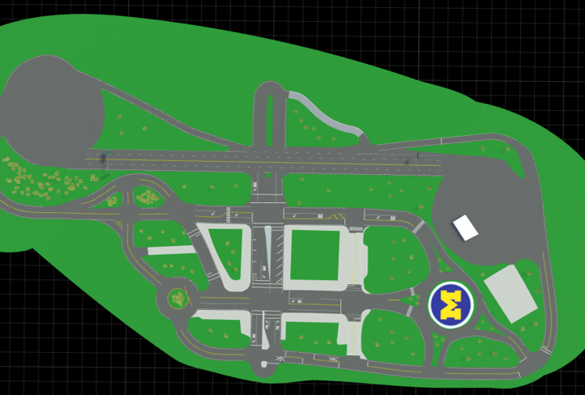

# Carla Challenge in Mcity

## Where does the challenge take place?
The challenge will be hold inside the Carla version of Mcity. Mcity is a 32-acre proving ground for the testing of connected and automated vehicles located on the University of Michigan in Ann Arbor, Michigan. We build the Carla Mcity based on the true dimensions/background of the real Mcity, and it serves as just another map of the Carla simulator. The supported Carla version is 0.9.9.4.





## What are the challenges?


The participant will be asked to control the vehicle under test (VUT) ('role_name' = "hero", spawned by the organizer) to follow a predefined route, shown as the blue curve in the figure. There will be 4 scenarios along the way, where the environment vehicles/pedestrian will attempt to challenge the VUT:
1. Cut-in
2. Car-following
3. Pedestrian crossing
4. Unprotected left turn
The VUT will be graded based on safety, speed and smoothness. 
Here is an example run of the challenge:
[](https://www.youtube.com/watch?v=rw22kinHzqM)
The nominal route for the challenge can be found in the github repo. 

## How to participate?
The simulator server and challenge scripte will be running on a dedicated server at University of Michigan. Participant are asked to remotely connect to our server through SSH tunnel with key authentication. Currently, the challenge is open to student teams from Stanford Univeristy, Massachusetts Institute of Technology and University of Michigan. 

Once the SSH tunnel is set up, you can connect to the server as if it is running on your computer. By default, Carla will use port 2000/2001. To enable relevant command sent to the server, we preserve the port 2002 for commands including restarting Carla server, evaluation script, etc. Therefore, you can add tunnel for 2002 when connecting. Here are the codes for sending command to control the challenge script:

```markdown
import socket

s = socket.socket(socket.AF_INET, socket.SOCK_STREAM)
s.connect(('localhost', 2002))
print(s.recv(1024))
# 1 for initializing from start; 2 before the pedestrian crossing; 3 before the left turn
data = bytes('1', 'utf8')
s.send(data)
s.close()
```

If you are interested in joining in the challenge, please contact Yuanxin(zyxin@umich.edu) or Xinpeng(xinpengw@umich.edu) first to get access to the server.


<!-- ## Welcome to GitHub Pages

You can use the [editor on GitHub](https://github.com/yyab/mcityCarlaChallenge.github.io/edit/main/README.md) to maintain and preview the content for your website in Markdown files.

Whenever you commit to this repository, GitHub Pages will run [Jekyll](https://jekyllrb.com/) to rebuild the pages in your site, from the content in your Markdown files.

### Markdown

Markdown is a lightweight and easy-to-use syntax for styling your writing. It includes conventions for

```markdown
Syntax highlighted code block

# Header 1
## Header 2
### Header 3

- Bulleted
- List

1. Numbered
2. List

**Bold** and _Italic_ and `Code` text

[Link](url) and 
```

For more details see [GitHub Flavored Markdown](https://guides.github.com/features/mastering-markdown/).

### Jekyll Themes

Your Pages site will use the layout and styles from the Jekyll theme you have selected in your [repository settings](https://github.com/yyab/mcityCarlaChallenge.github.io/settings). The name of this theme is saved in the Jekyll `_config.yml` configuration file.

### Support or Contact

Having trouble with Pages? Check out our [documentation](https://docs.github.com/categories/github-pages-basics/) or [contact support](https://github.com/contact) and we’ll help you sort it out. 

-->
